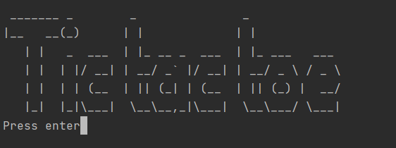
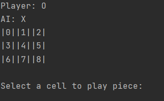

# TicTacToePython

  
 
In game footage

---

  
 
In game footage

[comment]: <> (![In game footage.]&#40;./img/main_menu.png "In game footage."&#41;)

[comment]: <> (---)

[comment]: <> (![In game footage.]&#40;./img/gameplay.png "In game footage."&#41;)
